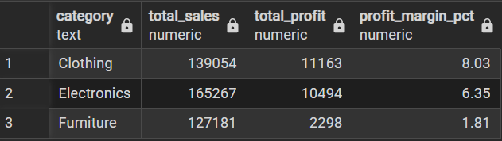
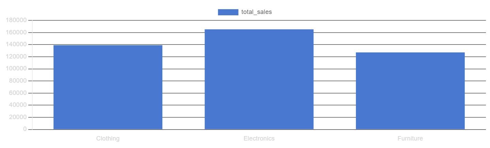
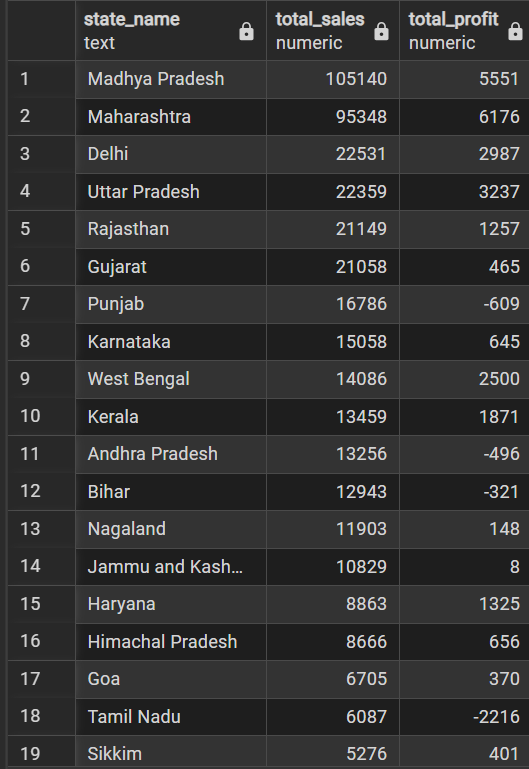
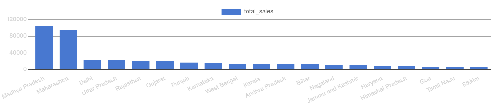
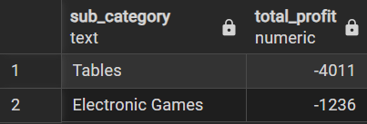
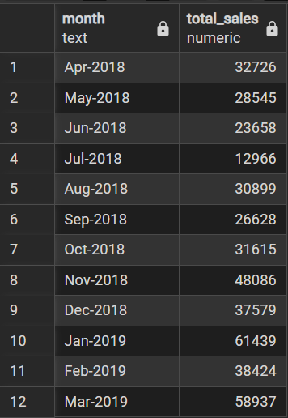
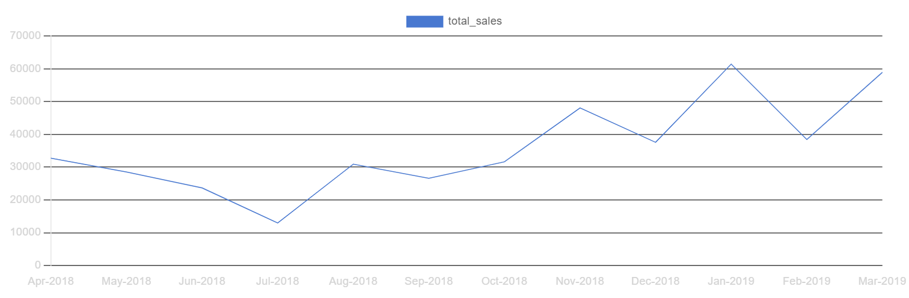
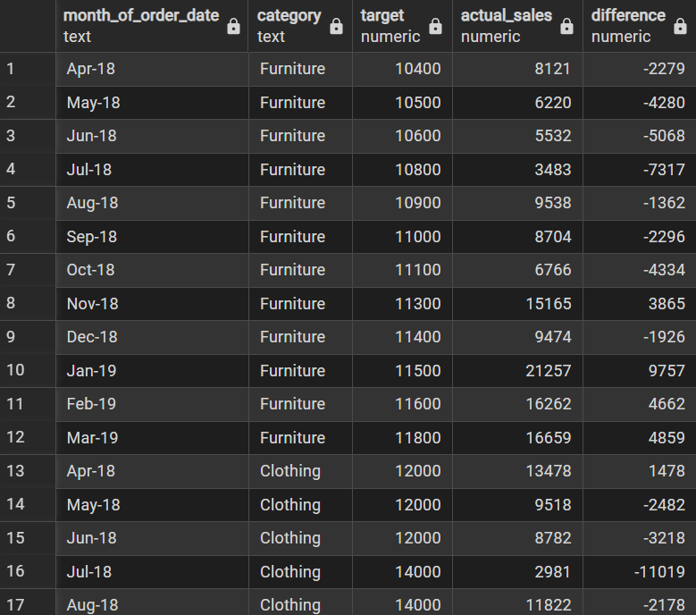
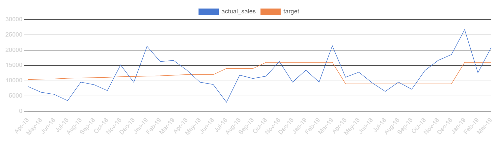

# 🛒 E-commerce Sales Analysis using SQL

## 📌 Project Overview

This project analyzes an E-commerce dataset using **PostgreSQL** to extract meaningful business insights. The objective is to evaluate sales performance, identify profit drivers, detect loss-making areas, and recommend strategies to improve overall business performance.

---

## 📂 Dataset Description

The dataset consists of three tables:

### 1. `list_of_orders`

* `order_id` – Unique order identifier
* `order_date` – Order date
* `customer_name` – Customer name
* `state_name` – State
* `city` – City

### 2. `order_details`

* `order_id` – Linked to orders
* `amount` – Sales amount
* `profit` – Profit
* `quantity` – Quantity sold
* `category` – Product category
* `sub_category` – Product sub-category

### 3. `sales_target`

* `month_of_order_date` – Month-Year
* `category` – Product category
* `target` – Sales target

---

## 🛠️ Tools & Technologies

* PostgreSQL
* pgAdmin
* SQL (Joins, Aggregations, Grouping, Case Statements)

---

## 🔍 Key Analysis Performed

* Customer Analysis & Segmentation
* Category Performance & Profitability
* Regional (State & City) Analysis
* Loss-Making Product Identification
* Monthly Sales Trend (Time-Series Analysis)
* Target vs Actual Performance
* Order-Level Profitability Analysis

---

# 📊 Visual Insights & Deep Analysis

## 📊 Category Performance Analysis

Clothing achieves the highest profit margin (~8%), while Furniture generates revenue but very low profit (~1.8%).




### 🔎 Insight:

* High revenue does not guarantee profitability
* Furniture is likely impacted by **high costs or heavy discounting**

### 💼 Business Recommendation:

* Re-evaluate pricing strategy for Furniture
* Reduce operational/logistics costs
* Focus marketing on high-margin categories like Clothing

---

## 🌍 State-wise Sales & Profit Analysis

States like Madhya Pradesh and Maharashtra lead in sales, while Tamil Nadu, Punjab, and Andhra Pradesh show losses.




### 🔎 Insight:

* Regional performance is highly uneven
* Some states generate revenue but still incur losses

### 💼 Business Recommendation:

* Investigate loss-making regions (pricing, shipping costs, demand)
* Optimize supply chain or limit expansion in weak regions
* Invest more in high-performing states

---

## 📉 Loss-Making Sub-Categories

Tables and Electronic Games consistently generate losses.



### 🔎 Insight:

* Losses are concentrated in specific products, not entire categories
* These products significantly impact overall profitability

### 💼 Business Recommendation:

* Discontinue or redesign pricing for loss-making products
* Bundle them with profitable items
* Analyze supplier costs and demand elasticity

---

## 📈 Monthly Sales Trend

Sales peak during November–January and drop significantly during mid-year months.




### 🔎 Insight:

* Strong **seasonality pattern**
* Revenue heavily depends on festive periods

### 💼 Business Recommendation:

* Increase marketing campaigns before peak season
* Offer discounts/promotions during low-demand months
* Improve inventory planning based on seasonal demand

---

## 🎯 Target vs Actual Performance

Electronics consistently exceeds targets, while Furniture underperforms and Clothing shows volatility.




### 🔎 Insight:

* Electronics is the **primary growth driver**
* Furniture fails to meet expectations
* Clothing demand is inconsistent

### 💼 Business Recommendation:

* Increase investment in Electronics category
* Improve forecasting and pricing for Clothing
* Reassess Furniture strategy (cost, demand, or product mix)

---

## 👥 Customer Segmentation

Most customers fall under the low-value segment, with very few medium-value customers and no high-value segment.


### 🔎 Insight:

* Revenue is spread across many small customers
* Lack of high-value or loyal customers

### 💼 Business Recommendation:

* Introduce loyalty programs and rewards
* Target high-value customer acquisition
* Personalize offers to increase customer lifetime value

---

## 🧾 Order-Level Analysis

Analysis of individual transactions shows mixed profitability within the same order.

### 🔎 Insight:

* A single order can contain both profit and loss items
* Loss-making products are often hidden within profitable orders

### 💼 Business Recommendation:

* Optimize bundling strategies
* Avoid combining high-loss products with discounts
* Monitor product-level margins more closely

---

## 🧠 Key Business Insights (Summary)

* Profitability varies significantly across categories and products
* Furniture is the weakest category in terms of margins
* Electronics is the strongest and most consistent performer
* Sales are highly seasonal, peaking during festive months
* Business relies heavily on low-value customers
* Certain products and regions consistently generate losses
* Hidden losses exist at the transaction level

---
## 📂 Repository Structure

```
Dataset/
├── list_of_orders.csv
├── order_details.csv
└── sales_target.csv
|
Output/
├── category_performance.png
├── loss_making_products.png
├── monthly_sales_trend.png
├── statewise_analysis.png
├── target_vs_actual_sales.png
|
SQL/
├── queries.sql
└── schema.sql
|
Visualisations/
├── actual_vs_target.png
├── category_performance.png
├── monthly_salestrend.png
├── statewise_sales.png
|
README.md
```


## 🚀 Conclusion

This project demonstrates how SQL can be leveraged to perform end-to-end business analysis. The findings highlight critical inefficiencies such as low-margin categories, loss-making products, and lack of high-value customers, while also identifying strong growth drivers like Electronics and seasonal sales opportunities.

---

## ⭐ Key Skills Demonstrated

* SQL Joins (INNER JOIN, LEFT JOIN)
* Aggregations (SUM, AVG, COUNT)
* Data Cleaning & Transformation
* Analytical Thinking
* Business Insight Generation
* Problem-Solving

---

## 📬 Connect

If you found this project useful, feel free to connect or give a ⭐ to the repository!

